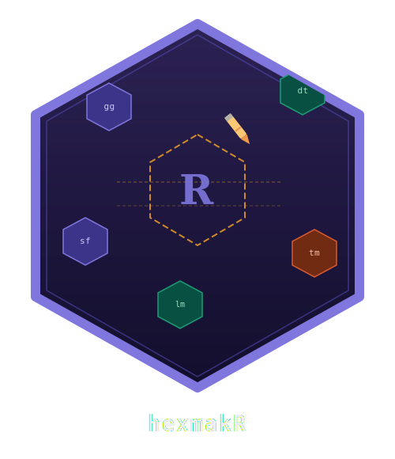

# hexmakR



## Overview

hexmakR is an interactive hex sticker generator for R packages. Design
publication-ready hexagon stickers visually through a Shiny app or
programmatically via R functions. Comes with 19 curated color themes
(dark + light), 46 built-in scientific and technical icons, custom image
support, font selection, and transparent PNG export.

## Standing on the shoulders of `hexSticker`

The excellent
[`hexSticker`](https://github.com/GuangchuangYu/hexSticker) package by
[Guangchuang Yu](https://yulab-smu.top) is the original and most widely
used hex sticker generator in the R ecosystem. Available on
[CRAN](https://cran.r-project.org/package=hexSticker), it provides a
powerful programmatic API built on ggplot2 that lets you embed any R
plot, lattice graphic, ggplot, or image file into a hex sticker — and
hundreds of R package stickers have been created with it.

**`hexmakR` is not a replacement for `hexSticker` — it is a
complement.** If you want to embed an actual R plot (base, lattice, or
ggplot2) into your sticker, `hexSticker` is the right tool. It excels at
code-first, reproducible sticker generation with full control over
subplot positioning.

`hexmakR` fills a different niche. It focuses on:

- **Interactive visual design** — a Shiny app where you see changes live
  and export when you’re happy, no code required
- **A curated theme library** — 19 domain-specific color palettes
  (Statistics, Bioinformatics, Genomics, Pharma, CRAN, Bioconductor,
  Tidyverse, and more) with one-click dark/light switching
- **A built-in icon library** — 46 hand-drawn scientific and technical
  icons across 7 categories, so you don’t need external image files
- **Font selection** — choose from 13 fonts with bold/italic toggles
  directly in the UI
- **Zero-to-sticker speed** — designed for the case where you want a
  good-looking hex sticker in under a minute without writing any code

We recommend trying both and using whichever fits your workflow. For
many users, the best approach is to prototype in `hexmakR`’s Shiny app
and then fine-tune programmatically — with either package.

## Installation

``` r
# CRAN
install.packages("hexmakR")

# Development version
# install.packages("pak")
pak::pak("r-heller/hexmakR")
```

## Quick Start

``` r
library(hexmakR)

# Three lines to a sticker
hex_sticker("mypackage", icon = "dna", theme = "genomics",
            filename = "man/figures/logo.png")
```

## Shiny App

``` r
hexmakr_app()
```

The Shiny designer opens in your browser with live preview. Adjust text,
pick an icon, choose a theme, and hit **Export PNG** when you’re happy.

## Feature Comparison

| Feature                              | hexSticker | hexmakR |
|--------------------------------------|------------|---------|
| Embed R plots (base/lattice/ggplot2) | ✅         | —       |
| Interactive Shiny designer           | —          | ✅      |
| Built-in icon library (46 icons)     | —          | ✅      |
| Curated theme presets (19 themes)    | —          | ✅      |
| Dark/light mode toggle               | —          | ✅      |
| Custom image upload                  | ✅         | ✅      |
| Font selection UI                    | —          | ✅      |
| Google Fonts support                 | ✅         | —       |
| Programmatic API                     | ✅         | ✅      |
| Returns ggplot object                | ✅         | ✅      |
| CRAN available                       | ✅         | ✅      |

## Available Themes

| Key        | Label              |
|------------|--------------------|
| `stats`    | Statistics         |
| `viz`      | Data Visualization |
| `bio`      | Biology            |
| `medical`  | Medical            |
| `tech`     | Technology         |
| `earth`    | Earth Sciences     |
| `cran`     | CRAN               |
| `bioc`     | Bioconductor       |
| `tidy`     | Tidyverse          |
| `genomics` | Genomics           |
| `proteo`   | Proteomics         |
| `pharma`   | Pharma             |
| `ocean`    | Ocean              |
| `midnight` | Midnight           |
| `cyber`    | Cyberpunk          |
| `neon`     | Neon               |
| `sunset`   | Sunset             |
| `viridis`  | Viridis            |
| `plasma`   | Plasma             |

Each theme has both `dark` and `light` variants.

## Available Icons

| Category  | Count | Icons                                                                    |
|-----------|-------|--------------------------------------------------------------------------|
| `science` | 5     | atom, flask, microscope, molecule, magnet                                |
| `biology` | 6     | dna, cell, brain, leaf, bacteria, tree                                   |
| `stats`   | 8     | bar_chart, scatter, line_chart, bell_curve, pie, sigma, boxplot, network |
| `medical` | 6     | stethoscope, heart, pulse, pill, cross, syringe                          |
| `tech`    | 6     | terminal, brackets, gear, database, hash, rlogo                          |
| `shapes`  | 7     | star, shield, diamond, hexagon, infinity, arrow_up, circle               |
| `fun`     | 8     | rocket, lightning, fire, sparkle, crown, coffee, music, gamepad          |

## Vignettes

- [Getting
  Started](https://r-heller.github.io/hexmakR/articles/getting-started.html)
- [Programmatic
  Usage](https://r-heller.github.io/hexmakR/articles/programmatic-usage.html)
- [Shiny
  App](https://r-heller.github.io/hexmakR/articles/shiny-app.html)

## Contributing

Contributions are welcome! Please open an issue first to discuss major
changes at
[github.com/r-heller/hexmakR/issues](https://github.com/r-heller/hexmakR/issues).

## Code of Conduct

Please note that the hexmakR project is released with a [Contributor
Code of
Conduct](https://contributor-covenant.org/version/2/1/code_of_conduct.html).
By contributing to this project, you agree to abide by its terms.

## Acknowledgements

hexmakR was inspired by the pioneering work of the
[`hexSticker`](https://github.com/GuangchuangYu/hexSticker) package. We
are grateful to Guangchuang Yu and all contributors for establishing hex
stickers as a staple of R package identity.
